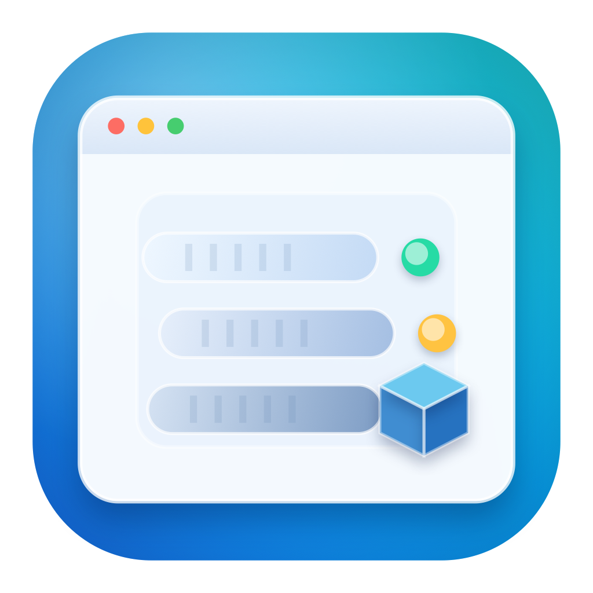

<p align="center">
  
</p>

# Apple Container GUI

A native macOS SwiftUI app for managing Apple's open-source [`container`](https://github.com/apple/container) runtime: containers, images, and builds — with a guided (and optionally fully automatic) setup flow that can install `container` for you.

The app shells out to the real `container` CLI and parses its `--format json` output; it does not reimplement the runtime. All CLI invocation goes through a single `CommandRunner` actor, so the logic layer is fully mockable and unit-tested.

## Screenshots

> Screenshots are placeholders. Run the app and drop real captures into `docs/screenshots/`, then update the links below.

| Containers | Container detail (Logs) | Images |
| --- | --- | --- |
|  |  |  |

| In-app terminal | Setup (full-auto install) |
| --- | --- |
|  |  |

## Features

- **Containers** — list, create/run, start, stop, and delete containers.
- **Tabbed container detail** — Details, live streaming **Logs**, and JSON **Inspect**, plus an in-app interactive **Terminal** attached to the container.
- **Images** — list local images and **pull** new ones.
- **Build** — build images from a Dockerfile/context.
- **Daemon control** — start the `container` daemon and surface its status.
- **Guided setup** — a launch-time readiness check gates the app:
  - *Semi-auto:* detects a missing binary or stopped daemon and offers to start the daemon / points you at install instructions.
  - *Full-auto:* downloads the latest signed installer `.pkg` (with progress), verifies its digest and code signature against a pinned Apple Team ID, installs it, starts the daemon, and re-checks until ready.

## Requirements

- **macOS 15+** (developed against macOS 26).
- **Apple Silicon.**
- Apple's [`container`](https://github.com/apple/container) runtime — the app can install it for you via the full-auto setup flow, or you can install it yourself (e.g. via Homebrew).

The app is distributed **unsandboxed** (Developer-ID signed + notarized) because it needs to invoke the `container` CLI and the system installer. The App Sandbox is intentionally not used.

## Build from source

The project is a pure **Swift Package** — no Xcode project required.

```sh
swift build          # compile gate
```

To produce a runnable `.app` bundle (a SwiftUI `@main` executable needs a real bundle with an Info.plist + activation policy to reliably show its window):

```sh
bash scripts/bundle.sh   # builds release + assembles AppleContainerGUI.app
open AppleContainerGUI.app
```

`scripts/smoke.sh` is the UI smoke gate: it bundles, launches the app, waits ~5s, asserts the process is still alive, then kills it. `scripts/notarize.sh` documents and scripts the Developer-ID codesign + notarization step (requires a Developer ID identity, which is not available in CI or this dev environment).

### App icon

The icon is an **original** "Window + Container Core" mark, drawn entirely from vector commands in `scripts/AppIcon.swift` — it does **not** embed Apple's official logo (see `Resources/sources/SOURCE.md`). Regenerate the full `Resources/AppIcon.icns` (16–1024 + @2x) and the `docs/icon-master-1024.png` master with:

```sh
bash scripts/make-icon.sh
```

The 1024 master can be imported into Apple's **Icon Composer** to apply a Liquid Glass treatment and export a `.icon` for Xcode 26.

## How auto-install works

On launch, `SetupCoordinator` resolves the `container` binary and queries daemon status:

- No binary → install guidance, with an optional one-click full-auto install.
- Binary present, daemon stopped → offer to start the daemon.
- Binary present, daemon running → proceed to the app.

The full-auto path (`runAutoSetup`) resolves the latest release `.pkg`, downloads it streaming progress, verifies the SHA-256 digest **and** the package signature/notarization against a pinned Apple Team ID before running the privileged installer, then starts the daemon and re-checks readiness. Any failure short-circuits to a recoverable error state.

> Note: the privileged install and the notarization step cannot be exercised in CI; they are unit-tested at the seams and documented here.

## Architecture

Two SwiftPM targets:

- **`Core`** (library) — all logic: the `CommandRunner` actor and `ContainerCLI`, the `ContainerService` protocol and `CLIContainerService` implementation, models, the `Installer` protocol + `GitHubInstaller`, the `SetupCoordinator` state machine, and the view models. Dependency-free and fully unit-tested.
- **`AppMain`** (executable) — the SwiftUI views (containers, images, build, logs, terminal, setup) plus the `MenuBarExtra`/app shell. Views contain no business logic.

The only third-party dependency is [SwiftTerm](https://github.com/migueldeicaza/SwiftTerm), used solely by `AppMain` for the in-app terminal. (SwiftTerm owns its own PTY/process handling for the terminal emulator; all other process invocation is confined to `Core`'s CLI layer.)

## Testing

Tests use the [swift-testing](https://github.com/apple/swift-testing) framework (`import Testing`).

- **In CI / with full Xcode:** a plain `swift test` runs the suite (see `.github/workflows/ci.yml`).
- **Command-Line-Tools-only machines:** a bare `swift test` builds but cannot `dlopen` the test framework on SwiftPM's default paths. Use the wrapper, which relinks against the CLT framework path:

  ```sh
  bash scripts/run-tests.sh
  ```

## Continuous integration

`.github/workflows/ci.yml` runs on push to `master` and on pull requests, on a GitHub `macos-15` runner. Because those runners ship a full Xcode, `swift test` actually executes the test suite there — making CI the project's real test gate. The workflow runs `swift build` then `swift test`, and caches `.build` keyed on `Package.resolved`.

## Contributing

Contributions are welcome. Please:

1. Fork and branch off `master`.
2. Keep all logic in `Core` (mockable, unit-tested) and keep `AppMain` views free of business logic.
3. Run `swift build` (zero warnings) and `bash scripts/run-tests.sh` before opening a PR.
4. New views should provide a `#Preview` behind `#if ENABLE_PREVIEWS`.

CI must be green before merge.

## License

MIT — see [LICENSE](LICENSE).
